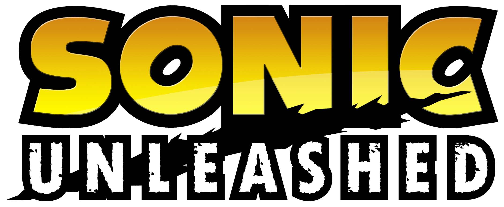

# The Unleashed Experience

In light of Sonic Unleashed (the best Sonic game to ever bless our existence) receiving a native port to PC in the form of a Recompilation, this mod aims to bring various gameplay aspects from Sonic Unleashed to Geometry Dash.
Why? Because ***I LOVE SONIC UNLEASHED GRAAAHHHH***

This mod is better enjoyed when paired with the Sonic Robot mod, using Modern SFX and Modern/Unleashed (Java) sprites. Get the mod for the best experience!!

## Features

This mod brings the following features from Sonic Unleashed:

- Various Sound Effects (such as Jump, Boost, and other voice lines.)
- Ranking System (Ranks S-E granted to the player on level completion.)
- Ranking Voicelines (Reactions Sonic has to your Rank in the original game.)
- Speed Meter (A meter that shows you your current speed at certain percentages, based on the one that shows every checkpoint in the original game.)
- "Title Card" (The text that shows up when starting a level.)
- Sonic Unleashed HUD