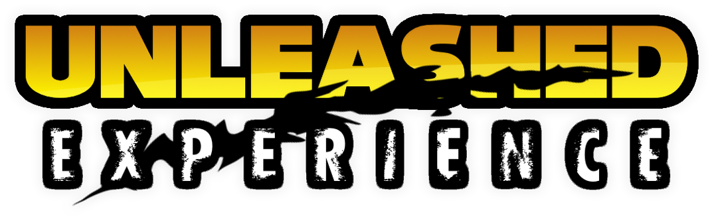

# Overview
In light of Sonic Unleashed (the best Sonic game to ever bless our existence) receiving a native port to PC in the form of a Recompilation, this mod was born. 
***The Unleashed Experience*** aims to bring various gameplay aspects from Sonic Unleashed to Geometry Dash, to make the game feel as if you're playing a Sonic Unleashed daytime stage.
Why? Because **I LOVE SONIC UNLEASHED GRAAAHHHH**

This mod replicates a TON of stuff from **Sonic Unleashed** and brings it all over to *Geometry Dash*, from basic stuff like SFX, to a fully-fledged **Custom Endscreen** when completing levels!
Most features of the mod are configurable/toggleable via the mod's **settings page**. Head on over there to check out how you can customize your ***Unleashed Experience*** to the fullest!

*This mod is better experienced when paired with the Sonic Robot Mod, as the Sonic Sprite Animations and some SFX features are exclusive to it. Get it to have the best experience!*

# Features
This mod adds a lot of *Gameplay* features from *Unleashed*, such as:

- ***Gameplay SFX and Voicelines:*** Sound Effects and Voicelines from Unleashed that are played on various gameplay events, such as Starting a level, Jumping, Reaching Max Speed (4x) and more!
- ***Full Sonic Unleashed HUD:*** Fully working remake of Unleashed's gameplay HUD, with elements such as:
    - Time & Jumps display (Top Left corner): Displays your current Level Time as well as your current jumps, updating in real time!
    - Lives icon and display (Top Left corner): Emulates the Life Counter from Unleashed, using the current level's star count as the number!
    - Ring Energy Gauge (Lower Left corner): Unleashed's boost meter, displaying your current Attempt, with the gauges filling up according to your Speed and Current Progress!
- ***Sonic Unleashed HUD Animations:*** Working remakes of some animations Unleashed plays during gameplay at certain events along with their SFX, such as:
    - "Here we... GO!": The iconic voiceline and animation when starting a level!
    - Speed Meter: Fully working remake of Unleashed's speed meter, which measures and shows you your current speed when reaching 20%, 50% and 80% on any level!
    - 1-up Animation: Remake of Unleashed's Extra Life animation, playing whenever you sum 100 jumps to your counter!
- ***Fully Remade Results Screen:*** My favorite part of the mod... Replaces the Vanilla Level Complete Screen with a custom, fully working and accurate remake of Sonic Unleashed's Results Screen! Fully functional with all the animations, SFX, and even Music! The Results Screen features an entirely new Ranking System like the one in Sonic games, which will award you a Rank (S-E) based on your performance in the level!

## Ranking System
This mod introduces an all-new **Ranking System**, which is used to assign you a *Rank* when completing a level! The **Ranking System** is based on how many ***Session Attempts*** you took to beat the level. The MAX attempt requirements for each Rank are as follows by default (*From Best rank to Worst rank*):

- ***S Rank:*** 1 Attempt
- ***A Rank:*** Up to 3 attempts
- ***B Rank:*** Up to 6 attempts
- ***C Rank:*** Up to 10 attempts
- ***D Rank:*** Up to 15 attempts
- ***E Rank:*** 16+ attempts

However, since it'd be too unfair to apply these values to every level regardless of difficulty, the mod also introduces a Leniency value system. The Leniency value defines how many more attempts you can do for each rank, essentially making the requirements more forgiving on harder difficulties. The Leniency Values are as follows:

- ***0-5 stars:*** 0 leniency, default requirements.
- ***6 stars:*** +1 leniency
- ***7 stars:*** +2 leniency
- ***8 stars:*** +3 leniency
- ***9 stars:*** +4 leniency
- ***Easy Demon:*** +5 leniency
- ***Medium Demon:*** +8 leniency
- ***Hard Demon:*** +10 leniency
- ***Insane Demon:*** +15 leniency
- ***Extreme Demon:*** +30 leniency

The formula for calculating Max Attempts per Rank is:

***Attempts <= BaseRequirement + Leniency***

With this, if you're, for example, playing an Extreme Demon, you can get an S Rank if your completion is done in less than 30 attempts, instead of having to do 1 attempt for it.

## Disclaimer(s)
*This mod is meant to be experienced mostly on Classic Levels, as the features from Unleashed it brings are from Daytime Sonic. While most (if not all) stuff WILL work in Platformer, this isn't the target mode at the time of the initial release. An update is planned to add Nighttime Stage aspects to platformer levels soon!*